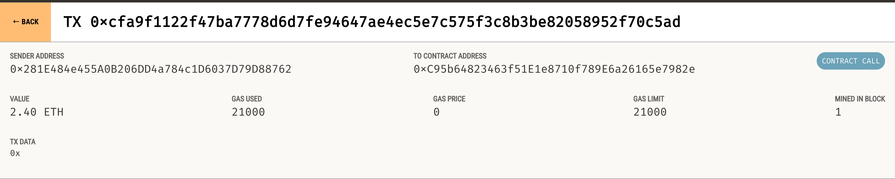
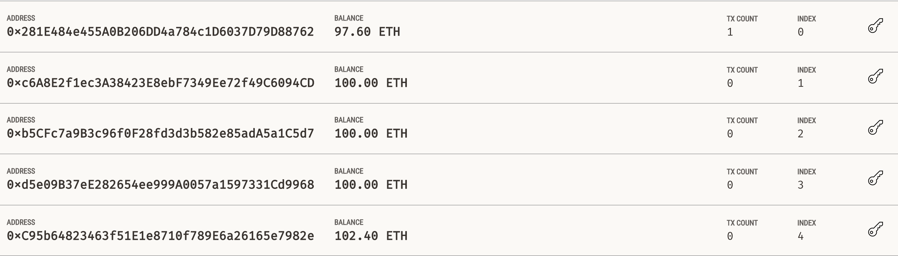

# Instant_Crypto_Payment

This Crypto payment service that is used to help find fintech professionals from among a list of candidates to hire them and pay them by integrating the application with ethereum blockchain. The below steps are followed:

1. Import Ethereum Transaction Functions into the application.

2. Sign and Execute a Payment Transaction.

3. Inspect the Transaction on Ganache.

---

## Technologies

This application works on python 3.7 and uses following libraries:

* [streamlit](https://docs.streamlit.io/) - Streamlit is an open-source Python library that makes it easy to create and share beautiful custom web apps.

* [Web3.py] (https://web3py.readthedocs.io/en/stable/overview.html) - A Python library for connecting to and performing operations on Ethereum-based blockchains.

* [ethereum-tester] (https://pypi.org/project/ethereum-tester/0.1.0a4/) - A Python library that provides access to the tools we’ll use to test Ethereum-based applications.

* [mnemonic] (https://pypi.org/project/mnemonic/) - A Python implementation for generating a 12- or 24-word mnemonic seed phrase based on the BIP-39 standard.

* [bip44] (https://pypi.org/project/bip44/) - A Python implementation for deriving hierarchical deterministic wallets from a seed phrase based on the BIP-44 standard.

* [Ganache] (https://trufflesuite.com/ganache/) - ​​A program that allows to quickly set up a local blockchain, which can be used to test and develop smart contracts.

---

## Installation Guide

Follow the following instructions before using the application.

```python
  pip install streamlit
  pip install ethereum-tester
  pip install mnemonic
  pip install bip44
  
```

---

## Detailed Explanation

### 1. Import Ethereum Transaction Functions into the application

1. The mnemonic seed phrase provided by ganache is added in `.env` file.

2. In `fintech_finder.py` the following functions are imported from the `crypto_wallet.py` file :

* generate account

* get_balance

* send_transaction

3. A variable named `account` is created int eh Streamlit sidebar section. It is set to call on the `generate_account` function. This function will create the apllication user's HD wallet and Ethereum account.

4. We define a new `st.sidebar.write` function that will display the balance of the User’s account. Inside this function, `get_balance` function is called and is passed the User's  Ethereum account.address.

### 2. Sign and Execute a Payment Transaction

To calculate the fintech professional's wage based on the worker's hourly rate and the number of hours that they work for a customer in the `candidate_databse` and send a transaction that pays the worker the below steps are followed.

1. Once a fintect professional is selected from the application interface’s drop-down menu, and after the amount of time for which the will be hired is entered, the application calculates the amount the worker will be paid in ether.

2. The calculated amount is then displayed in the Streamlit sidebar using `st.sidebar.write`

3. To send an Ethereum blockchain transaction that pays the hired candidate, `send_transaction` function is called by passing three parameters :

* User's `account` information

* The `candidate_address`

* The `wage` value calculated in the previous step.

4. The transaction hash returned from the `send_transaction` function is saved in a variable name `transaction_hash` and is displayed.

### 3. Inspect the Transaction

1. From the terminal, navigate to the project folder that contains the `.env` file and the `fintech_finder.py` and `crypto_wallet.py` files. Be sure to activate your Conda dev environment if it is not already active

2. To launch the Streamlit application, type `streamlit run fintech_finder.py`.

3. On the resulting webpage, select a candidate that you would like to hire from the appropriate drop-down menu. Then, enter the number of hours that you would like to hire them for.

4. Click the Send Transaction button to sign and send the transaction with your Ethereum account information.

Example transaction's screenshot:


